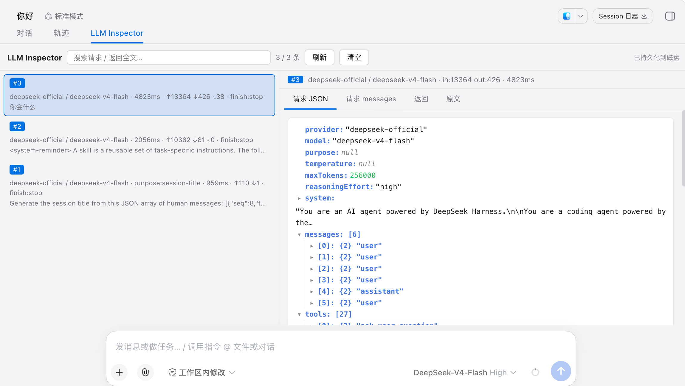

# LLM Inspector

LLM Inspector 是 DeepSeek Harness Web 的调用日志插件。它在会话页面增加独立的 `LLM Inspector` 标签页，用于查看模型请求、消息、返回内容、Token 用量、耗时和工具调用。



## 功能

- 按 Session 记录完整的 LLM 请求与响应。
- 展示模型、Provider、耗时、Token 用量和完成原因。
- 支持请求、消息、返回和原文四种详情视图。
- 支持全文搜索、手动刷新和清空当前 Session 的日志。
- 每个 Session 独立编号，新 Session 从 `#1` 开始。
- 日志持久化到本地，重启 DSH 后仍可查看。

## 安装

LLM Inspector 需要 DeepSeek Harness Web 和 Node.js `^22.19.0 || >=24.0.0`。

从 npm 安装发布版本：

```sh
dsh plugin --profile web add dsh-llm-capture
```

在 npm 版本发布前，可以直接从 GitHub 安装：

```sh
dsh plugin --profile web add github:chengzhicao/llm-inspector
```

安装完成后启动 Web：

```sh
dsh web
```

需要卸载时执行：

```sh
dsh plugin --profile web remove dsh-llm-capture
```

## 使用

1. 打开或创建一个会话并发起模型调用。
2. 点击会话顶部的 `LLM Inspector` 标签页。
3. 在左侧选择一次调用，在右侧查看请求、消息、返回或原文。
4. 使用搜索框过滤当前 Session 的请求和返回内容。
5. 点击“清空”会清除当前 Session 的内存记录，并将对应日志文件覆盖为空数组；其他 Session 不受影响。

## 日志存储

日志默认保存在启动 DSH 时的工作目录下：

```text
tmp/llm-inspector-data/
```

每个 Session 对应一个 JSON 文件。日志文件包含完整提示词、消息、工具参数和模型返回，请勿提交到版本库或发送给不受信任的第三方。

可以在 `$DSH_HOME/cordis.patch.yml` 中覆盖存储配置：

```yaml
- id: llm-capture
  config:
    directory: tmp/llm-inspector-data
    capacity: 500
    flushDelayMs: 400
```

| 配置项 | 默认值 | 说明 |
| --- | --- | --- |
| `directory` | `tmp/llm-inspector-data` | 日志目录；相对路径基于 DSH 的工作目录解析 |
| `capacity` | `500` | 每个 Session 在内存和磁盘中保留的最大记录数 |
| `flushDelayMs` | `400` | 合并连续磁盘写入的等待时间，单位为毫秒 |

修改配置后重启 DSH 生效。插件不会自动迁移自定义目录中的旧日志。

## 工作方式

Host 插件监听 `llm/stream`，在不改变模型输出的前提下收集请求和流式返回，并按 Session 写入 JSON 文件。Web Client 通过 `llmLog` Remote 接口读取和清空记录，不直接访问主机文件系统。

## 项目地址

- GitHub: <https://github.com/chengzhicao/llm-inspector>
- Issues: <https://github.com/chengzhicao/llm-inspector/issues>
